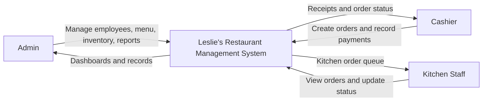
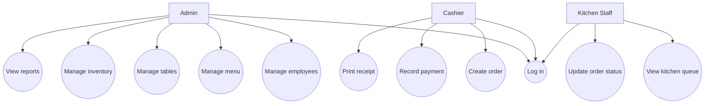
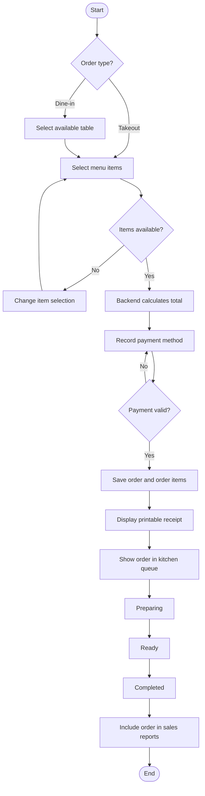
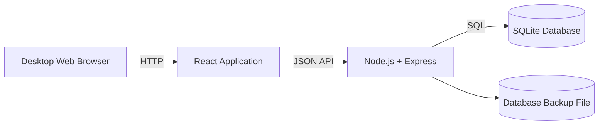

# System Diagrams

## Context Diagram

```mermaid
flowchart LR
    Admin[Admin] -->|Manage employees, menu, inventory, reports| System[Leslie's Restaurant Management System]
    Cashier[Cashier] -->|Create orders and record payments| System
    Kitchen[Kitchen Staff] -->|View orders and update status| System
    System -->|Dashboards and records| Admin
    System -->|Receipts and order status| Cashier
    System -->|Kitchen order queue| Kitchen
```

## Use-Case Overview

```mermaid
flowchart TB
    Admin[Admin]
    Cashier[Cashier]
    Kitchen[Kitchen Staff]

    Login((Log in))
    Employees((Manage employees))
    Menu((Manage menu))
    Tables((Manage tables))
    Inventory((Manage inventory))
    Reports((View reports))
    Orders((Create order))
    Payment((Record payment))
    Receipt((Print receipt))
    Queue((View kitchen queue))
    Status((Update order status))

    Admin --> Login
    Admin --> Employees
    Admin --> Menu
    Admin --> Tables
    Admin --> Inventory
    Admin --> Reports
    Cashier --> Login
    Cashier --> Orders
    Cashier --> Payment
    Cashier --> Receipt
    Kitchen --> Login
    Kitchen --> Queue
    Kitchen --> Status
```

## Order Activity Diagram

```mermaid
flowchart TD
    Start([Start]) --> Type{Order type?}
    Type -->|Dine-in| Table[Select available table]
    Type -->|Takeout| Items[Select menu items]
    Table --> Items
    Items --> Available{Items available?}
    Available -->|No| Change[Change item selection]
    Change --> Items
    Available -->|Yes| Total[Backend calculates total]
    Total --> Pay[Record payment method]
    Pay --> Valid{Payment valid?}
    Valid -->|No| Pay
    Valid -->|Yes| Save[Save order and order items]
    Save --> Receipt[Display printable receipt]
    Receipt --> Kitchen[Show order in kitchen queue]
    Kitchen --> Preparing[Preparing]
    Preparing --> Ready[Ready]
    Ready --> Complete[Completed]
    Complete --> Report[Include order in sales reports]
    Report --> End([End])
```

## Local Deployment Diagram

```mermaid
flowchart LR
    Browser[Desktop Web Browser] -->|HTTP| React[React Application]
    React -->|JSON API| Express[Node.js + Express]
    Express -->|SQL| SQLite[(SQLite Database)]
    Express --> Backup[(Database Backup File)]
```

